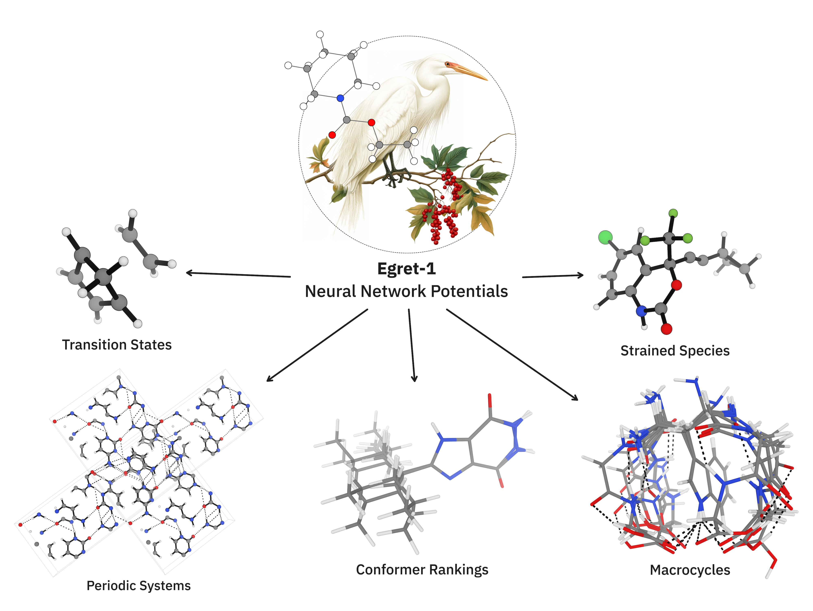

# Egret Neural Network Potentials

<p align="center">

</p>

This repository contains the **Egret** family of neural network potentials, developed by Rowan using the [MACE](https://github.com/ACEsuit/mace) architecture.  
You can use the pretrained model weights locally or run predictions directly via the [Rowan web platform](https://labs.rowansci.com/).

For questions or issues, please open a GitHub issue or contact the Rowan team at contact@rowansci.com.

## Egret Model Suite

We provide three general-purpose models, released under the MIT license:

- **Egret-1** — optimized for bioorganic molecules; a strong general-purpose model  
- **Egret-1E** — enhanced with main-group chemistry data; excels at thermochemistry  
- **Egret-1T** — trained on transition states; ideal for modeling chemical reactivity  

## Example: Using Egret-1 with ASE
Egret-1 is compatible with the [ASE](https://wiki.fysik.dtu.dk/ase/) interface. The following is an example using the mace_off calculator from the mace-torch package:

```python
import ase.io
from ase.calculators.calculator import all_changes

from mace.calculators import mace_off

atoms = read("<path_to_molecule_file>")

calculator = mace_off(model="<path_to_model/EGRET_1.model>", default_dtype="float32")

calculator.calculate(atoms, ["<ASE_task_1>", "<ASE_task_2>"], all_changes)

print(calculator.results)
```  

## Local Usage
Install the required packages using 
```
conda env create -f environment.yml
conda activate egret-env      
```

To run the example script, run 
```
python example.py
```

These models can run on either CPU or GPU. 

